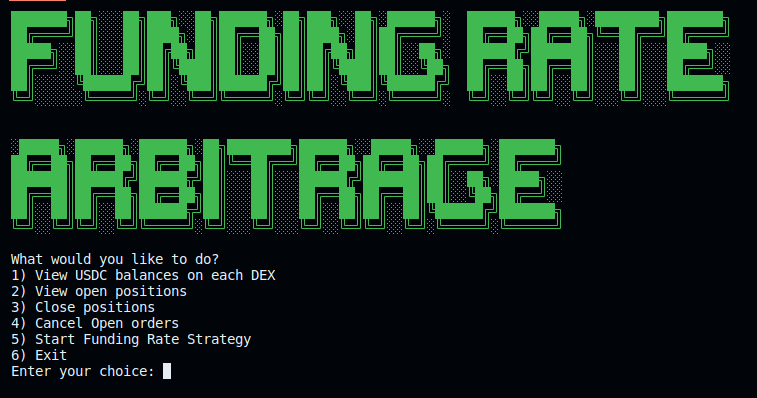
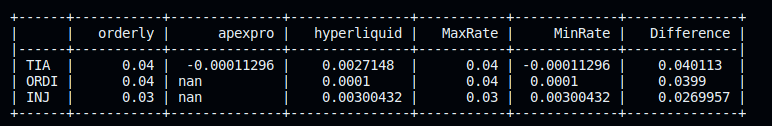
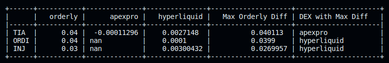
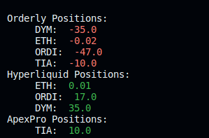
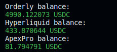
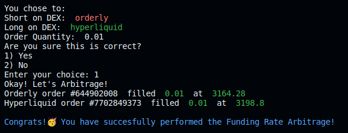

# fundarb

**Cross-venue funding-rate arbitrage CLI for crypto perpetuals.**

[](LICENSE)
[](https://www.python.org/downloads/)

> **EXPERIMENTAL — DO NOT USE WITH REAL FUNDS.** This repo is a personal sandbox for funding-rate arbitrage research. Multiple code paths are stubs or have known bugs. Use only on testnet, only as a reference for the techniques, and audit every line before any live use.

Async client + interactive CLI that compares funding rates across major decentralised perpetual venues, surfaces basis-trade opportunities, and executes the delta-neutral leg on the user's signature key. Used for live signal generation and execution on personal capital — not a hosted service.

> **Disclaimer.** This is a personal research tool. Crypto perpetual trading is risky; funding rates change every 1–8h; venue uptime and oracle pricing are not guaranteed. Use at your own risk. No financial advice. The maintainer is not responsible for losses, liquidations, or venue-specific issues.

---

## What it does

1. **Polls funding rates** from each venue's public REST API on a fixed interval.
2. **Normalises symbols** across venues — `BTC_USDC` (Backpack), `PERP_BTC_USDC` (Orderly), `BTC` (Hyperliquid) all collapse to `BTC`.
3. **Computes pairwise rate deltas** — funds you receive on the long leg minus funds you pay on the short leg, annualised.
4. **Surfaces arb opportunities** — pairs whose 1y-normalised funding-rate spread clears a configurable threshold (default ≥ 5%/yr) after estimated trading and bridging costs.
5. **Executes the delta-neutral pair** — Hyperliquid (EIP-712 signed) + Orderly (ed25519 signed) + Backpack (ed25519 signed) — in single-CLI flow with size and slippage caps.
6. **Monitors positions** and surfaces P&L attribution between funding-realised flow and mark-price drift.

## Supported venues

| Venue | Status | Auth | Notes |
|---|---|---|---|
| **Hyperliquid** | Live | EIP-712 (eth-account) | Spot + perp markets; reads public meta endpoint for funding |
| **Orderly Network** | Live | Ed25519 + EIP-712 onboarding | Uses Orderly's signing-broker model; account ID + secret key required |
| **Backpack** | Live | Ed25519 (base58) | Mainnet only; testnet endpoints not always available |
| **Apex Pro** | Scaffolded, not active | n/a | `src/apex/` contains an early scaffold; not wired into the live menu |

The CLI shows only the three live venues. Apex code is retained for future expansion.

## Quick start

```bash
git clone https://github.com/mkzung/fundarb.git
cd fundarb
python3 -m venv .venv && source .venv/bin/activate
pip install -r requirements.txt
cp .env.example .env     # then fill in HL_PRIVATE_KEY / ORDERLY_ACCOUNT_ID / ORDERLY_SECRET / BACKPACK_PUBLIC_KEY / BACKPACK_PRIVATE_KEY
python main.py
```

The CLI launches an interactive `prompt_toolkit` menu — start with **"Show funding-rate deltas across all DEXs"** to verify connectivity before signing anything.

### Network mode

Set `RUN_MAINNET=1` in `.env` to hit mainnet endpoints. Default is testnet for Hyperliquid and Orderly. Backpack mainnet-only.

## Screenshots

| | |
|---|---|
| Main menu |  |
| Funding-rate deltas across DEXs |  |
| Funding-rate deltas vs Orderly |  |
| Open positions |  |
| Account balances |  |
| Order filled |  |

## Architecture

```
main.py                  ← interactive prompt_toolkit menu
src/
  hyperliq/              ← Hyperliquid SDK wrapper (uses hyperliquid-python-sdk)
    funding_rate.py
    order.py
    hyperliq_utils.py
  orderly/               ← Orderly Network client (EIP-712 onboarding + ed25519 request signing)
    client.py
    funding_rate.py
    order.py
    position.py
    eip712.py
  backpack/              ← Backpack client (ed25519 + base58 signing)
    funding_rate.py
  apex/                  ← Apex Pro scaffold (not active)
  strategies/
    funding_rate_arbitrage.py   ← cross-venue spread + arb selection
```

Pure-Python; no compiled or proprietary dependencies. Each venue module isolates auth + endpoint specifics so adding a new venue is a single sub-package.

## Risk controls

- **Slippage cap** + **size cap** enforced before every order submission.
- **Testnet-default** — set `RUN_MAINNET=1` explicitly to trade real funds.
- **Local-only secrets** — `.env` is gitignored; secrets never leave the process.
- **No remote callback / no API key forwarding** — the CLI is a direct client-to-venue tool.

## Roadmap

- [ ] Add CI workflow (lint + smoke import).
- [ ] Add `pytest` suite for symbol normalisation + spread calculation.
- [ ] Wire `apex` venue once Apex Pro public funding-rate endpoint is stable.
- [ ] Expand to Drift (Solana) once Anchor program account decoding is wired.
- [ ] Position-level P&L attribution graphs.

## License

MIT — see [LICENSE](LICENSE).

## Author

Max Gorbuk · [github.com/mkzung](https://github.com/mkzung) · Researcher at Stanford GSB Venture Capital Initiative.
